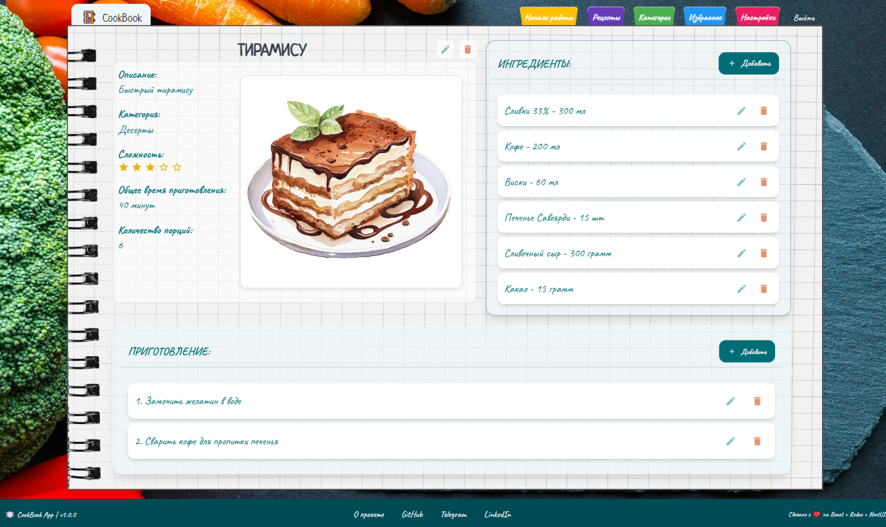

# CookBook

_Кулинарная книга_

## Цель:
Сочетание уюта и атмосферности бумажной версии и удобства электронной

## Technologies:
- React
- React-router-dom
- Redux
- RTK
- TS
- Tailwind
- Heroui(nextui)
- Framer-Motion
- Supabase
- Toastify
- Vite
<!-- - Jest -->

## Application functionality:
- Пользователи:
	- Авторизация и регистрация
	- Восстановление и изменение пароля
- CRUD-операции для рецептов (добавление, редактирование, удаление), загрузка изображений, управление ингредиентами, шагами приготовления, категориями
- Фильтрация и поиск рецептов по:
	- категориям
	- сложности
	- ингредиентам

## Тестовый аккаунт для просмотра:
- Почта:
abc2@gmail.com
- Пароль:
7gyC@Pada_23918hdas

## Deployment:
https://cook-book-app.vercel.app/
